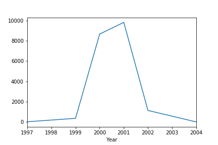
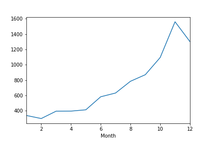
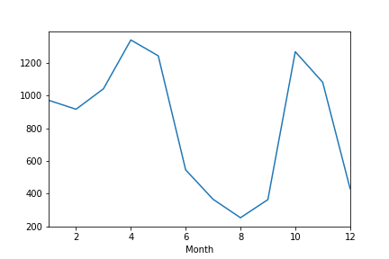
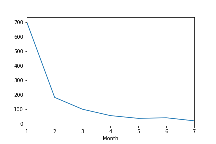
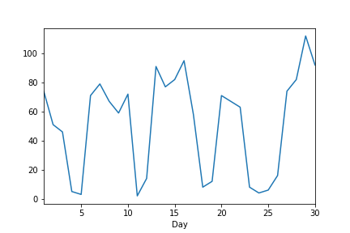
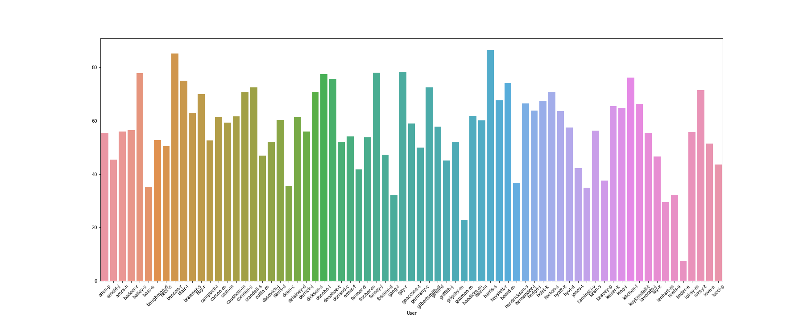
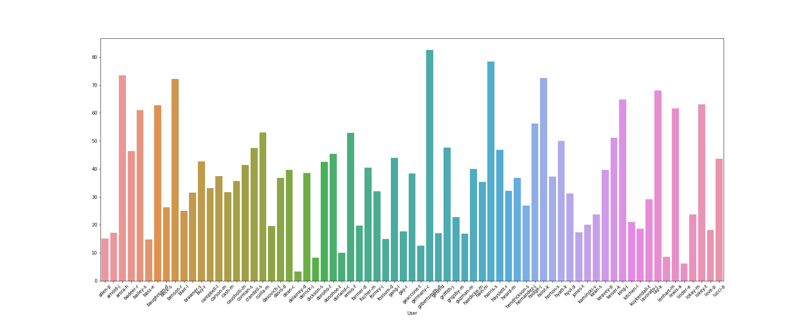
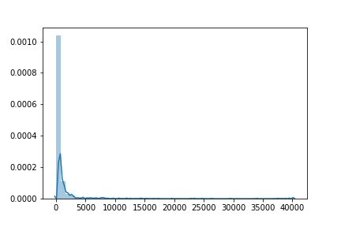
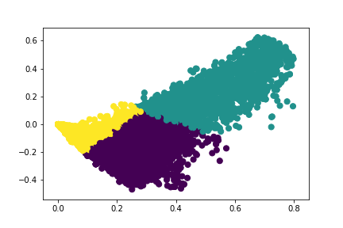
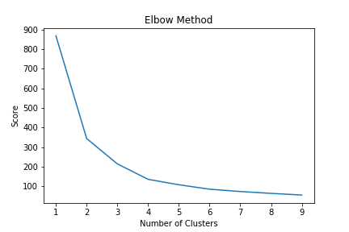

## Background: 
***Introduction*** 
The Enron Corpus is a revolutionary technology in the world of Natural Language Processing. It was born out of a shocking financial scandal that occurred in mid-2001 at the financial firm Enron. A culture of overvaluing stock prices, a rather bombastic set of executives, and a habit of “cooking the books” set Enron’s stock price tumbling—from $92 in 2000 to less than $1 just under a year later. To me, the Enron Corpus represents an opportunity to understand people as they operate in their work life—albeit at a hypercompetitive company. 
***Size*** 
An important consideration with the Enron corpus is its size. This is certainly something I’ll harp on in the Data Cleaning section of this report, but it bears mentioning now: the Enron corpus is large and leveled. By this I mean that the corpus has many different natural patterns of organization—whether it be 150-some sets of emails by user, one set of emails by every user, grouping emails by subject or TFIDF vectors, et cetera. The physical size of the corpus is around 2GB, but I would argue that this is deceiving, as the entire corpus is plain text. In addition, there are several thousand directories that delineate and inform the corpus. Quite a maze to navigate with grace. 
## Data Organization: 
This is the first class I’ve taken that dealt significantly with large corpora. This is the second Python class I’ve taken. It’s worth mentioning this because organization was a colossal task for me. The corpus comes very clean—raw files of text with emails in the MIME format.
1. ***Failed Attempts***:  Despite this, I was unaware of what the MIME format even was, and thus I first tried to organize the corpus with a series of unpleasant loops and .open()’s. After some research,  I found a tool in Python called the “email parser”, which takes MIME formatted texts and outputs a series of tags and data. This made my life a lot easier.
2. **Email Parser Module**:  Moving on from MIME, I now had to look to read in emails from every user. I accomplished this using the OS library and the .fileids() method. Obviously when you’re reading through hundreds of thousands of files you’re going to stub your toe once or twice, so I qualified my algorithm with a pair of exceptions that detail which level of the file directory threw the error. This method reads through just above 99% of the corpus. 
3. **OS**:
- I’d also like to highlight that while this algorithm does use a triple-nested for-loop, this is because the file structure itself is roughly three levels deep. Capitalizing on this, I generalized the file structure to simplify my algorithm. This comes at the cost of two assumptions. First, that there are no files on the first or second level of the hierarchy (that they are only folders). And second, that there is only files on the third level of the hierarchy. The latter is the much more unrealistic assumption, as many avid emailers have folders within folders. It’s important to note these things because my algorithm is customized to this specific corpus—it would not work on most file hierarchies.
- Using this algorithm—under these aforementioned assumptions—I was able to read in most of the corpus. The program made it to around 70% through the corpus (‘shackelford’) where the kernel died. This was a common theme in my time with the dataset: in its entirety it is just past the computational ability of a personal computer. While it isn’t the size of other corpora that we’ve worked with this semester (cough cough the Yelp dataset cough cough), it is too large for my local kernel to handle. Higher resource computing on this dataset is on my bucket list.
4. **The Finished Product**:  The finished product out of this stage was a very large pickled file called ‘emails’, produced by my third notebook. This pickle contains a data frame that holds around 70% of the emails from the Enron dataset. The data frame contains all of the information from the MIME tags, the text, and even more after data exploration.
## DATA EXPLORATION:  
***Introduction***  
My data exploration stage was unique but very rewarding. Let’s start with rewarding. There were three main things I wanted to see in my non-machine learning data exploration—the diachronic context of the data, the ability to profile users as a result of their emails, and finally textual analysis. Finally, I limited the scope of my data exploration to a sample of 20,000 emails, as the full set would have been burdensome on my local machine.
chronology 
***Chronology***  
The distribution of emails was very interesting. We know from history that Enron was very profitable from the mid-1990’s to 2001 when it went belly up. The data bears this out, as we see the vast majority of emails come in 2000 and 2001. I was a little shocked that there was not as much data from the 90’s, but it could be the small sample or maybe Enron was spinning the fastest at the turn of the millennia. The line graphs below track the number of emails in my sample across years, and then the months in 2000, 2001, and 2002 respectively. 
 
 
 
 
Likewise, I have fell into another unanswered question that has me very curious—how can the Enron corpus tell us about how people experience major events in the context of work/email? Although the company was based in Houston, Texas, I would have to imagine that there was an office in New York. This is worth mentioning because the dataset does include emails from the day of the September 11th terrorist attacks. The graph below shows that there was a drop in emails, but the sample size is likely too small to consider this. I’d like to run this program with larger memory and more emails to look back at this graph again—and to examine the emails that were sent that day. 
  
***Profiling Users***  
The next topic I explored in the data was undoubtedly the most interesting to me—profiling users. If we had to model the everyday work lives of individuals, perhaps we could make the assumption that their emails and the environments in which they are suspended can represent the people who send them. While this is not theoretically bullet-proof, a similar idea has pushed computational semantics towards distributional semantics and word embeddings—a huge innovation in semantics and NLP generally.
I modeled users with a few different measurements. The trait I looked at was the number of unique email addresses each user sent messages to and received messages from. This number was much lower than I thought, at around 5% to unique addresses and 20% from unique addresses. I then looked at the emails of E. Linder, who sent and received emails from the least number of unique addresses (around 10% each). This claim was born out as we saw his emails were mostly comprised of seemingly automatic emails. Look at that! 
 
 
Finally, while the previous two traits described the entire population of emails, I also looked at the average words per email of one specific user, J. Dasovich. This user averaged about 750 words per email, which seems like a lot for an email. However, when we look at the distribution of all of his emails, we can see that there are a few *huge* outliers that drive up the average—one is over 7,000 words (possibly a tokenization problem). It’s worth noting that to find the average length of every user’s email requires a *ton* of computation, as it would require tokenizing the entire corpus.
 
## Unsupervised Learning
With these details in mind, I moved on to accomplishing my task of classifying legal vs. incriminating emails. There is, however, a huge roadblock in the way of doing our standard classifier treatment—the lack of metadata. As I mentioned earlier, the only data that comes with this corpus are the directories and the raw files at the bottom of them. The files don’t contain a ‘1’ for positive sentiment and a ‘0’ for negative, or ‘1’ for talking-about-money-laundering-ishness and ‘0’ for nothing-to-see-here-ocity. It’s just the emails. Because of this, we are faced with two options. The first is unsupervised learning.
For this approach, I looked to use K-clustering to find emails that had similar TFIDF vectors. This is a fantastic approach in theory, but unfortunately the clusters were not very beneficial. 
 
First and foremost, these don’t really look much like clusters, do they. It’s really more like one big ghost-shaped blob. That being said, I conducted and elbow test and found that three clusters was optimal.  
 
However, even after the elbow test, we have a problem. The idea behind doing unsupervised learning is to have clusters that represent some sort of human-readable domain. In this case, I was hoping that one of these domains would represent the “smokey” emails. Despite these hopes, none of the three clusters represented a batch of illegal messages that we could use to train a classifier. Therefore, in the practical sense of the word, my goal is unachievable—at least with my rudimentary knowledge of unsupervised learning. The only hypothesis I would posit to find a “smokey” cluster would be to severely up the cluster numbers or to scope out the TFIDF vectors more carefully.
The other option to train a Smoking Gun classifier on this dataset would be to manually annotate the data. Unfortunately, this is extremely time intensive and would likely require in the order of tens of thousands of annotations—something not feasible for this term.
